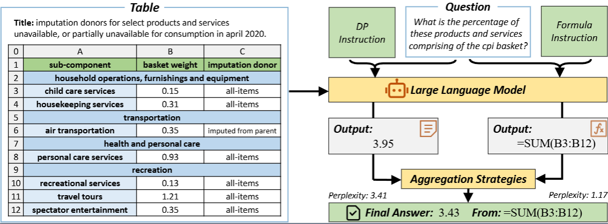

## FormulaQA

The FormulaQA dataset is in the folder `./data/formulaqa`

## TabAF

The implementation for paper General Table Question Answering via Answer-Formula Joint Generation

### Overview



### Preliminary

* We use [LLaMA-Factory](https://github.com/hiyouga/LLaMA-Factory/tree/main) for training and inference.

  ```shell
  git clone https://github.com/hiyouga/LLaMA-Factory.git
  cd LLaMA-Factory
  conda create -n tabaf python=3.11
  pip install -e ".[torch,metrics]"
  
  # For inference & evaluation
  pip install openai==1.5.0
  pip install xlwings==0.33.4
  ```

* File Overwrite: Download the `LLaMA-Factory` folder from **this** repository and overwrite the **official** `LLaMA-Factory` repository

* Download & Preprocess Dataset

  * Download [WTQ](https://nlp.stanford.edu/software/sempre/wikitable/), [HiTab](https://github.com/microsoft/HiTab), [TabFact](https://github.com/wenhuchen/Table-Fact-Checking) from their website and move them into the fold `./LLaMA-Factory/data`. Unzip packages and remove unuseful files.
  * Use the preprocessing scripts in the `./LLaMA-Factory/preprocess` folder to preprocess these dataset.
  * We have prepared the processed files for each test set in the folder `./data`.

### Training

* The default hyperparameter configurations are in the following YAML files:

  ```shell
  llamafactory-cli train configs/tabaf/llama3.1-8b/train.yaml
  llamafactory-cli train configs/tabaf/llama3.1-70b/train.yaml
  llamafactory-cli train configs/tabaf/qwen2.5-7b/train.yaml
  llamafactory-cli train configs/tabaf/qwen2.5-14b/train.yaml
  llamafactory-cli train configs/tabaf/qwen2.5-32b/train.yaml
  ```

### Testing

* Start the inference backend:

  ```
  llamafactory-cli api configs/tabaf/llama3.1-8b/api.yaml
  llamafactory-cli api configs/tabaf/llama3.1-70b/api.yaml
  llamafactory-cli api configs/tabaf/qwen2.5-7b/api.yaml
  llamafactory-cli api configs/tabaf/qwen2.5-14b/api.yaml
  llamafactory-cli api configs/tabaf/qwen2.5-32b/api.yaml
  ```

* Call API to inference Formulas or Answers

  ```shell
  python generate.py --base_model qwen2.5-coder-7b
  python generate.py --base_model qwen2.5-coder-14b
  python generate.py --base_model qwen2.5-coder-32b
  python generate.py --base_model llama3.1-8b
  python generate.py --base_model llama3.1-70b
  ```

  > Note:
  >
  > We used the HF Engine for model inference and computed Perplexity based on the log probability of output tokens. We did not use the vLLM Engine because, during our experiments, there were issues with its logprobs computation, which showed significant inconsistencies compared to the HF Engine.

* Execute Formulas:

  ```shell
  python execute.py --base_model qwen2.5-coder-7b
  python execute.py --base_model qwen2.5-coder-14b
  python execute.py --base_model qwen2.5-coder-32b
  python execute.py --base_model llama3.1-8b
  python execute.py --base_model llama3.1-70b
  ```

* Evaluate:

  ```
  python evaluate.py --base_model qwen2.5-coder-7b
  python evaluate.py --base_model qwen2.5-coder-14b
  python evaluate.py --base_model qwen2.5-coder-32b
  python evaluate.py --base_model llama3.1-8b
  python evaluate.py --base_model llama3.1-70b
  ```
